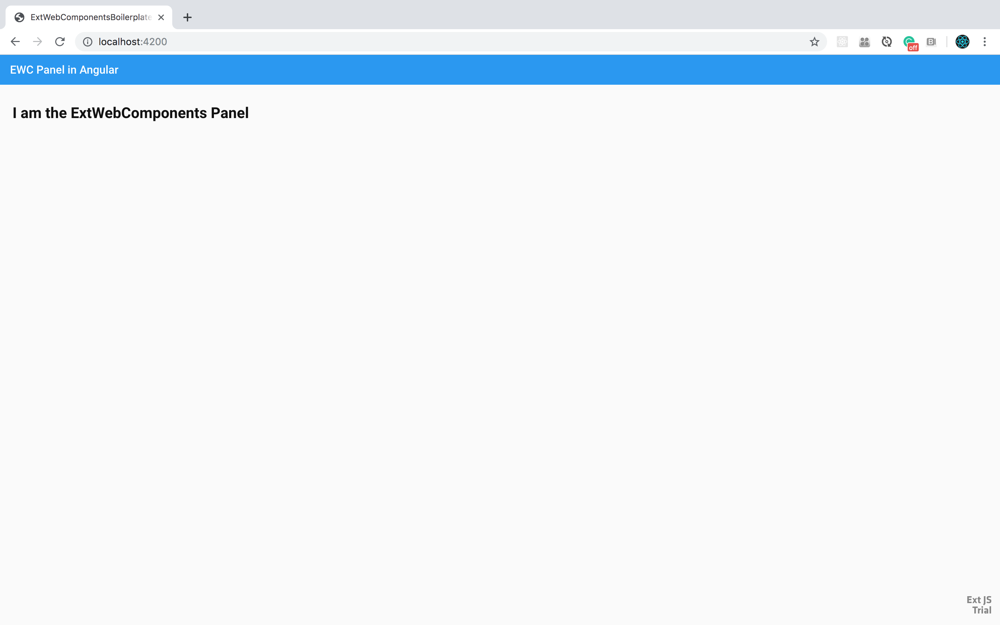

## Adding Sencha ExtWebComponents to an Angular CLI application

This document defines the steps needed to add Sencha ExtWebComponents to a Angular application generated with Angular CLI. Angular CLI is described in the [Angular CLI Overview](https://cli.angular.io/)

If you don’t want to follow the below mentioned steps, then you can consume the boilerplate code with a sample ExtWebComponents application at [ext-web-components-boilerplate-angular-cli](https://github.com/sencha/ext-web-components/tree/ext-components-7.0.x/packages/ext-web-components-boilerplate-angular-cli).

### Install the Angular CLI

more details at: https://angular.io/cli#installing-angular-cli

To install Angular CLI, bring up a terminal or command window and use the following command:

```sh
npm install -g @angular/cli
```

### Create an Angular CLI starter application

more details at: https://angular.io/cli/new#ng-new

To create an Angular CLI starter application, continue in the terminal or command window and 'cd' to the folder where you want to create your new application. Then, use the following command to create your new Angular CLI application.

```sh
ng new ext-web-components-boilerplate-angular-cli
```

The Angular CLI starts up and then asks a series of questions as selections - either refer to the Angular documentation noted above and you may choose on the basis of application or you may follow the steps below:

- For 'Would you like to add Angular routing?' , write 'y' and press 'enter'
- For 'Which stylesheet format would you like to use?', select 'CSS' and press 'enter'

The 'ng new' command will run and create the base angular application.

Once the 'ng new' command is finished, move to the newly created folder and run the application:

```sh
cd  ext-web-components-boilerplate-angular-cli
ng serve
```

Browse to http://localhost:4200/ in your browser. You should see the 'Welcome to ext-web-components-boilerplate-angular-cli!' page in the browser.

Now, stop the 'ng serve' app from running in the terminal/command window (ctrl-c). This prepares you for the next steps.

### Add Sencha ExtWebComponents to your Angular CLI starter application

To Add ExtWebComponents to your newly created Angular CLI starter application, bring up the created application in your favorite editor or IDE - for example, to use Visual Studio Code, cancel the currently running sample application in the terminal or command window and type 'code .' in the terminal or command window.

```sh
code .
```

For the next steps, make sure you are logged into the Sencha npm repository - for instructions, see this link: https://github.com/sencha/ext-web-components/blob/ext-components-7.0.x/README.md

#### Do 1 of the next 2 steps:

either...
Add the following to the dependencies section of package.json:

```sh
"@sencha/ext-web-components-modern": "~7.2.1",
"@sencha/ext": "^7.0.0",
"@sencha/ext-modern": "^7.0.0",
"@sencha/ext-modern-theme-material": "^7.0.0",
"@sencha/ext-webpack-plugin": "^7.0.0",
"@webcomponents/webcomponentsjs": "^2.2.10",
"@angular-builders/custom-webpack": "^8.1.0",
"@angular-builders/dev-server": "^7.3.1",
```

To install the npm dependencies, in the terminal or command window run the following:

```sh
npm install
```

or...
Run the following commands in the terminal/command window:

```sh
npm install --save @sencha/ext-web-components @sencha/ext @sencha/ext-modern @sencha/ext-modern-theme-material
npm install --save @sencha/ext-webpack-plugin
npm install --save @webcomponents/webcomponentsjs
npm install --save @angular-builders/custom-webpack
npm install --save @angular-builders/dev-server
```

#### Edit angular.json, index.html, app.module.ts, app component files, and Add custom-webpack.config.js

To introduce custom webpack configuration, we first need to make changes inside angular.json file.

For **ng build** command, configure the architect/build object in the angular.json file and update the builder from _@angular-devkit/build-angular:browser_ to _@angular-builders/custom-webpack:browser_ and add the customWebpackConfig key inside options like:

```sh
"builder": "@angular-builders/custom-webpack:browser",
"options": {
  "customWebpackConfig": {
    "path": "./custom-webpack.config.js",
    "replaceDuplicatePlugins": true
  },
  ... other options
```

For **ng serve** command, update the serve/builder in the angular.json file:

```sh
"serve": {
  "builder": "@angular-builders/custom-webpack:dev-server",
... other options
```

To configure the ext-webpack-plugin for webpack in Angular, create a file named **custom-webpack.config.js** at the root directory (where the package.json is), and add the following:

```sh
const CopyWebpackPlugin = require('copy-webpack-plugin');
const ExtWebpackPlugin = require('@sencha/ext-webpack-plugin');
const HtmlWebpackPlugin = require('html-webpack-plugin');
const path = require('path');

module.exports = {
  devServer: {
    contentBase: 'dist',
  },
  output: {
    path: path.join(__dirname, 'dist'),
  },
  plugins: [
    new HtmlWebpackPlugin({}),
    new ExtWebpackPlugin({
      framework: 'web-components',
      toolkit: 'modern',
      theme: 'theme-material',
      emit: 'yes',
      script: '',
      packages: [],
      profile: '',
      environment: 'development',
      treeshake: 'no',
      browser: 'no',
      watch: 'yes',
      verbose: 'no'
    }),
    new CopyWebpackPlugin([{
        from: './node_modules/@webcomponents/webcomponentsjs/webcomponents-bundle.js',
        to: './webcomponents-bundle.js'
    }])
  ]
};
```

Replace src/app/app.module.ts with the following:

```sh
import { BrowserModule } from '@angular/platform-browser';
import { NgModule, CUSTOM_ELEMENTS_SCHEMA } from '@angular/core';

import { AppRoutingModule } from './app-routing.module';
import { AppComponent } from './app.component';
import '@sencha/ext-web-components/dist/ext-panel.component';

@NgModule({
  declarations: [
    AppComponent
  ],
  imports: [
    BrowserModule,
    AppRoutingModule
  ],
  providers: [],
  schemas: [ CUSTOM_ELEMENTS_SCHEMA ],
  bootstrap: [AppComponent]
})
export class AppModule { }
```

Add Ext.js and Ext.css inside the inside index.html and also webcomponents-bundle.js for the compatibility of Web Components with all major browsers, For more info: http://webcomponents.github.io/

```sh
<!doctype html>
<html lang="en">
<head>
  <meta charset="utf-8">
  <title>ExtWebComponentsBoilerplateAngularCli</title>
  <base href="/">
  <script src="webcomponents-bundle.js"></script>
  <meta name="viewport" content="width=device-width, initial-scale=1">
  <link rel="icon" type="image/x-icon" href="favicon.ico">
  <link rel="stylesheet" href="ext/ext.css">
</head>
<body>
  <script src="ext/ext.js"></script>
  <app-root></app-root>
</body>
</html>
```

Replace src/app/app.component.html with the following:

```sh
<ext-panel
  title="EWC Panel in Angular"
  bodyPadding="20px"
>
    <h1>I am the ExtWebComponents Panel</h1>
</ext-panel>
```

#### Run the application

In the terminal or command window, run the application:

```sh
ng serve
```

or

```sh
npm start
```

Browse to http://localhost:4200 in your browser. You should see the Angular starter application with an ExtWebComponents Panel in the browser.


